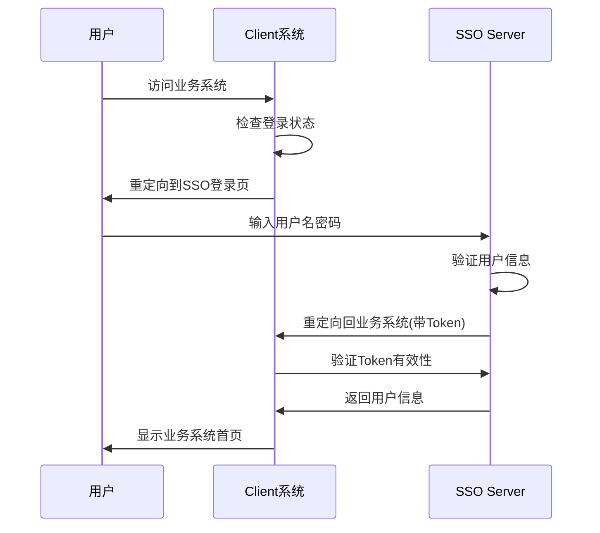
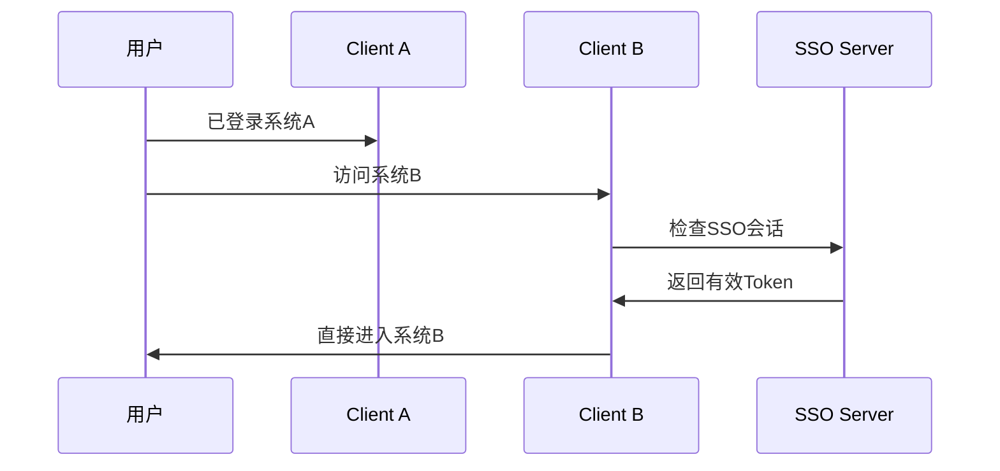

# 企业级SSO系统架构设计方案

## 🎯 总体架构概览

```
┌─────────────────────────────────────────────────────────────────┐
│                    企业级SSO系统架构                              │
├─────────────────────────────────────────────────────────────────┤
│                                                                 │
│  ┌─────────────┐    ┌─────────────┐    ┌─────────────┐         │
│  │   Client A  │    │   Client B  │    │   Client C  │         │
│  │  (业务系统1) │    │  (业务系统2) │    │  (业务系统3) │         │
│  │             │    │             │    │             │         │
│  │ Spring Boot │    │ Spring Boot │    │   Node.js   │         │
│  │   + Vue     │    │  + React    │    │   + Vue     │         │
│  └─────────────┘    └─────────────┘    └─────────────┘         │
│         │                   │                   │               │
│         └───────────────────┼───────────────────┘               │
│                             │                                   │
│                    ┌─────────────────┐                         │
│                    │   API Gateway   │                         │
│                    │   (可选负载均衡)  │                         │
│                    └─────────────────┘                         │
│                             │                                   │
│                    ┌─────────────────┐                         │
│                    │  SSO Server     │                         │
│                    │  (认证中心)      │                         │
│                    │                 │                         │
│                    │ Spring Boot     │                         │
│                    │ + Sa-Token      │                         │
│                    │ + OAuth2        │                         │
│                    └─────────────────┘                         │
│                             │                                   │
│                    ┌─────────────────┐                         │
│                    │   Database      │                         │
│                    │   (MySQL)       │                         │
│                    └─────────────────┘                         │
│                                                                 │
└─────────────────────────────────────────────────────────────────┘
```

## 📋 职责划分方案

### 🔵 Server层（SSO认证中心）职责

#### 核心职责
- **用户生命周期管理**: 注册、登录、注销、密码管理
- **认证服务**: 统一登录、单点登录、单点登出
- **授权管理**: 角色权限分配、权限校验
- **Token管理**: 生成、验证、刷新、撤销
- **第三方集成**: 微信、支付宝、企业微信等第三方登录
- **安全审计**: 登录日志、操作记录、风险监控

#### 技术实现
```
SSO-Server/
├── 认证模块 (Authentication)
│   ├── 用户登录/注册
│   ├── 密码管理
│   ├── 第三方登录
│   └── 多因子认证
├── 授权模块 (Authorization)
│   ├── 角色管理
│   ├── 权限管理
│   ├── 用户组管理
│   └── 权限校验
├── Token管理模块
│   ├── JWT/Sa-Token生成
│   ├── Token验证
│   ├── Token刷新
│   └── Token黑名单
├── SSO协议模块
│   ├── OAuth2.0
│   ├── SAML 2.0
│   ├── CAS协议
│   └── 自定义SSO
└── 管理后台
    ├── 用户管理
    ├── 系统配置
    ├── 监控面板
    └── 审计日志
```

### 🟢 Client层（业务系统）职责

#### 核心职责
- **业务逻辑实现**: 专注核心业务功能开发
- **SSO集成**: 接入认证中心，处理登录回调
- **本地会话管理**: 维护用户登录状态
- **权限适配**: 将SSO权限映射到业务功能
- **用户体验**: 提供友好的登录/登出界面

#### 技术实现
```
SSO-Client/
├── SSO集成模块
│   ├── 登录重定向
│   ├── 回调处理
│   ├── Token获取
│   └── 登出同步
├── 会话管理模块
│   ├── 用户状态维护
│   ├── Token存储
│   ├── 自动刷新
│   └── 过期处理
├── 权限适配模块
│   ├── 权限映射
│   ├── 路由守卫
│   ├── 按钮权限
│   └── 数据权限
└── 业务模块
    ├── 业务功能A
    ├── 业务功能B
    ├── 业务功能C
    └── ...
```

## 🔄 交互流程设计

### 1. 用户首次访问流程


### 2. 跨系统免登录流程


## 🛠️ 技术实现方案

### Server层实现方案

#### 1. 核心技术栈
```yaml
技术选型:
  框架: Spring Boot 3.x
  认证: Sa-Token + OAuth2
  数据库: MySQL 8.0
  缓存: Redis 6.0
  消息队列: RabbitMQ (可选)
  监控: Spring Boot Actuator + Micrometer
```

#### 2. 关键配置
```yaml
# application.yml
sa-token:
  token-name: Authorization
  timeout: 7200
  is-concurrent: true
  is-share: false
  sso:
    is-sso: true
    auth-url: /sso/auth
    is-http: true
    secretkey: ${SSO_SECRET_KEY}

oauth2:
  clients:
    - client-id: business-system-a
      client-secret: ${CLIENT_A_SECRET}
      redirect-uris: 
        - http://localhost:8082/sso/callback
      scopes: read,write
```

### Client层最简化实现方案

#### 1. 依赖配置
```xml
<!-- pom.xml -->
<dependencies>
    <dependency>
        <groupId>cn.dev33</groupId>
        <artifactId>sa-token-sso</artifactId>
        <version>1.44.0</version>
    </dependency>
    <dependency>
        <groupId>org.springframework.boot</groupId>
        <artifactId>spring-boot-starter-web</artifactId>
    </dependency>
</dependencies>
```

#### 2. 最简配置
```yaml
# application.yml
server:
  port: 8082

sa-token:
  sso:
    server-url: http://localhost:8081
    auth-url: http://localhost:8081/sso/auth
    is-http: true
    secretkey: ${SSO_SECRET_KEY}
```

#### 3. 核心代码结构
```java
// 主页面空壳控制器
@RestController
public class HomeController {
    
    @GetMapping("/")
    public String home() {
        if (StpUtil.isLogin()) {
            return "欢迎进入业务系统，用户ID: " + StpUtil.getLoginId();
        }
        return "请先登录";
    }
    
    @GetMapping("/sso/callback")
    public Object ssoCallback() {
        return SaSsoHandle.clientRequest();
    }
}

// SSO配置类
@Configuration
public class SsoConfig implements WebMvcConfigurer {
    
    @Override
    public void addInterceptors(InterceptorRegistry registry) {
        registry.addInterceptor(new SaInterceptor(handle -> {
            SaRouter.match("/**")
                   .notMatch("/sso/callback", "/", "/public/**")
                   .check(r -> StpUtil.checkLogin());
        })).addPathPatterns("/**");
    }
}
```

## 🔐 安全交互保障

### 1. Token安全传输
```java
// Server端Token生成
@Service
public class TokenService {
    
    public String generateToken(Long userId) {
        return StpUtil.createLoginSession(userId);
    }
    
    public boolean validateToken(String token) {
        return StpUtil.getLoginIdByToken(token) != null;
    }
}

// Client端Token验证
@Component
public class TokenValidator {
    
    @Value("${sa-token.sso.server-url}")
    private String ssoServerUrl;
    
    public boolean validateWithServer(String token) {
        String url = ssoServerUrl + "/sso/validate?token=" + token;
        // HTTP调用验证
        return HttpUtil.get(url).contains("valid");
    }
}
```

### 2. 权限同步机制
```java
// Server端权限接口
@RestController
public class PermissionController {
    
    @GetMapping("/sso/permissions")
    public Result<List<String>> getUserPermissions(@RequestParam String token) {
        Long userId = StpUtil.getLoginIdByToken(token);
        List<String> permissions = permissionService.getUserPermissions(userId);
        return Result.success(permissions);
    }
}

// Client端权限缓存
@Service
public class PermissionCache {
    
    @Cacheable(value = "user_permissions", key = "#userId")
    public List<String> getUserPermissions(Long userId) {
        String token = StpUtil.getTokenValue();
        String url = ssoServerUrl + "/sso/permissions?token=" + token;
        return HttpUtil.get(url, List.class);
    }
}
```

## 📊 模块依赖关系

### 接口定义
```java
// SSO Server对外接口
public interface SsoServerApi {
    
    // 认证相关
    Result<String> authenticate(LoginRequest request);
    Result<Void> logout(String token);
    Result<Boolean> validateToken(String token);
    
    // 用户信息
    Result<UserInfo> getUserInfo(String token);
    Result<List<String>> getUserPermissions(String token);
    Result<List<String>> getUserRoles(String token);
    
    // Token管理
    Result<String> refreshToken(String token);
    Result<Void> revokeToken(String token);
}

// SSO Client集成接口
public interface SsoClientIntegration {
    
    // 登录相关
    void redirectToLogin(String returnUrl);
    boolean handleCallback(String code, String state);
    void logout();
    
    // 会话管理
    boolean isLoggedIn();
    UserInfo getCurrentUser();
    List<String> getCurrentUserPermissions();
    
    // 权限检查
    boolean hasPermission(String permission);
    boolean hasRole(String role);
}
```

## 🎯 开发建议

### Client层开发者关注点
1. **专注业务逻辑**: 不需要关心认证实现细节
2. **使用统一接口**: 通过SsoClientIntegration接口操作
3. **权限适配**: 将SSO权限映射到具体业务功能
4. **用户体验**: 处理登录超时、权限不足等场景

### Server层开发者关注点
1. **安全性**: Token安全、防重放攻击、会话管理
2. **性能**: 高并发认证、缓存策略、数据库优化
3. **扩展性**: 支持多种认证方式、第三方集成
4. **监控**: 登录统计、异常告警、性能监控

## 🚀 实施路线图

### 阶段1: 基础SSO功能 (1-2周)
- [ ] Server端基础认证功能
- [ ] Client端最简集成
- [ ] 基础Token管理

### 阶段2: 完善功能 (2-3周)
- [ ] 权限管理系统
- [ ] 第三方登录集成
- [ ] 管理后台开发

### 阶段3: 生产优化 (1-2周)
- [ ] 性能优化
- [ ] 安全加固
- [ ] 监控告警

这个架构设计确保了Client层开发者可以专注业务开发，而Server层提供稳定可靠的认证服务，两者通过标准化接口进行交互，实现了职责分离和系统解耦。
