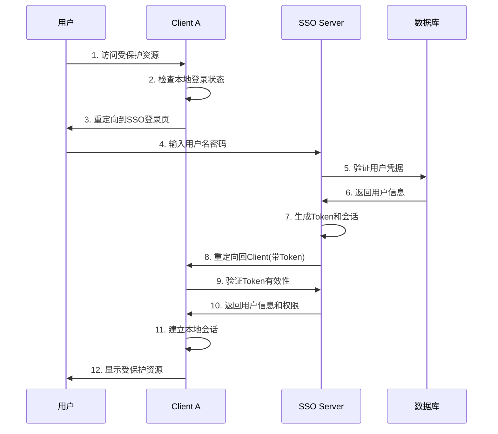
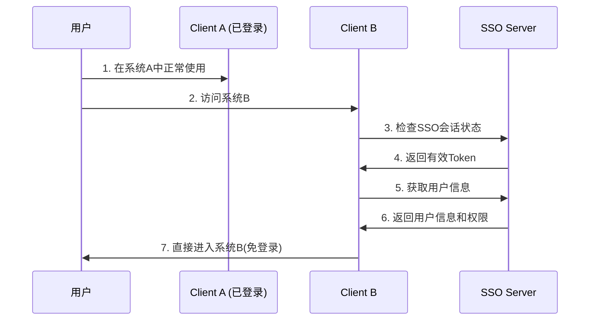
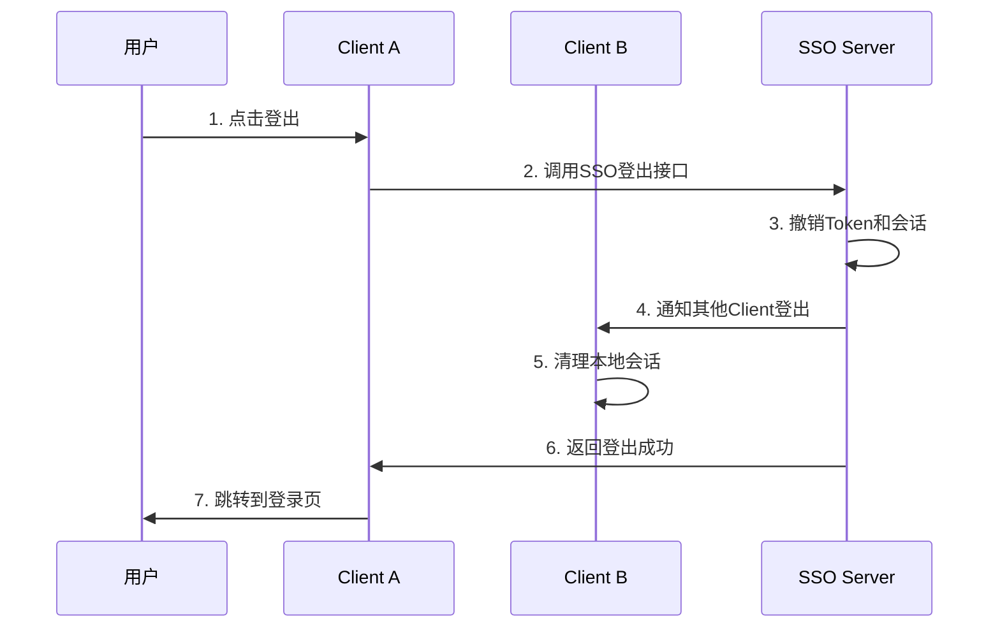

# SSO系统交互规范和接口标准

## 🎯 设计原则

### 职责分离原则
- **Server层**: 专注认证、授权、用户管理
- **Client层**: 专注业务逻辑，认证透明化
- **接口标准化**: 统一的API规范，便于多系统接入

### 开发者友好原则
- **Client开发者**: 只需关注业务开发，认证逻辑完全透明
- **最小集成成本**: 几行配置即可完成SSO接入
- **标准化流程**: 遵循OAuth2/OIDC等标准协议

## 🔄 核心交互流程

### 1. 首次登录流程


### 2. 跨系统免登录流程


### 3. 单点登出流程


## 📋 标准化接口规范

### 1. SSO Server对外接口

#### 认证相关接口
```yaml
# 用户登录
POST /auth/login
Content-Type: application/json
{
  "account": "string",      # 用户名/手机号/邮箱
  "password": "string",     # 密码
  "loginType": "username",  # 登录类型: username/phone/email
  "captcha": "string",      # 验证码(可选)
  "rememberMe": false       # 记住我(可选)
}

Response:
{
  "code": 200,
  "message": "登录成功",
  "data": {
    "accessToken": "eyJhbGciOiJIUzI1NiIs...",
    "refreshToken": "550e8400-e29b-41d4-a716-446655440000",
    "expiresIn": 7200,
    "tokenType": "Bearer",
    "user": {
      "id": 1,
      "username": "admin",
      "realName": "管理员",
      "email": "admin@example.com"
    }
  }
}

# Token验证
GET /auth/validate?token={token}
Response:
{
  "code": 200,
  "message": "Token有效",
  "data": {
    "valid": true,
    "userId": 1,
    "username": "admin",
    "expiresAt": "2024-01-01T12:00:00Z"
  }
}

# Token刷新
POST /auth/refresh
Content-Type: application/json
{
  "refreshToken": "550e8400-e29b-41d4-a716-446655440000"
}
```

#### SSO协议接口
```yaml
# SSO认证入口
GET /sso/auth?redirect={clientUrl}&client_id={clientId}
# 自动处理登录状态检查和重定向

# 获取用户信息
GET /sso/userinfo?token={token}
Response:
{
  "code": 200,
  "data": {
    "id": 1,
    "username": "admin",
    "realName": "管理员",
    "email": "admin@example.com",
    "phone": "13800138000",
    "userType": 1,
    "status": 1,
    "lastLoginTime": "2024-01-01T10:00:00Z"
  }
}

# 获取用户权限
GET /sso/permissions?token={token}
Response:
{
  "code": 200,
  "data": {
    "userId": 1,
    "roles": ["admin", "user"],
    "permissions": [
      "system:user:list",
      "system:user:add",
      "system:role:list"
    ]
  }
}

# SSO登出
POST /sso/logout
Content-Type: application/json
{
  "token": "eyJhbGciOiJIUzI1NiIs...",
  "clientId": "business-system-a"
}
```

### 2. Client端集成接口

#### 最简集成方式
```java
// 1. 添加依赖和配置
@Configuration
public class SsoClientConfig {
    
    @Bean
    public SsoClientIntegration ssoClient() {
        return SsoClientIntegration.builder()
                .serverUrl("http://localhost:8081")
                .clientId("business-system-a")
                .clientSecret("client-secret")
                .redirectUri("http://localhost:8082/sso/callback")
                .build();
    }
}

// 2. 使用统一接口
@RestController
public class BusinessController {
    
    @Autowired
    private SsoClientIntegration ssoClient;
    
    @GetMapping("/protected")
    public String protectedResource() {
        // 自动处理登录检查
        if (!ssoClient.isLoggedIn()) {
            ssoClient.redirectToLogin();
            return null;
        }
        
        UserInfo user = ssoClient.getCurrentUser();
        return "Hello, " + user.getRealName();
    }
    
    @GetMapping("/admin")
    @PreAuthorize("@ssoClient.hasPermission('system:admin')")
    public String adminResource() {
        return "管理员专用功能";
    }
}
```

#### 标准化Client接口
```java
public interface SsoClientIntegration {
    
    // 登录状态检查
    boolean isLoggedIn();
    
    // 获取当前用户
    UserInfo getCurrentUser();
    
    // 获取用户权限
    List<String> getCurrentUserPermissions();
    
    // 权限检查
    boolean hasPermission(String permission);
    boolean hasRole(String role);
    
    // 登录登出
    void redirectToLogin(String returnUrl);
    boolean handleCallback(String code, String state);
    void logout();
    
    // Token管理
    String getAccessToken();
    boolean refreshToken();
}
```

## 🛡️ 安全交互保障

### 1. Token安全传输
```yaml
安全措施:
  - HTTPS强制传输
  - Token签名验证
  - 短期有效期(2小时)
  - 刷新Token机制
  - Token黑名单管理

传输格式:
  Header: "Authorization: Bearer {token}"
  或
  Parameter: "?token={token}"
```

### 2. 跨域安全
```java
@Configuration
public class CorsConfig {
    
    @Bean
    public CorsConfigurationSource corsConfigurationSource() {
        CorsConfiguration configuration = new CorsConfiguration();
        
        // 允许的客户端域名(生产环境需要严格配置)
        configuration.setAllowedOriginPatterns(Arrays.asList(
            "http://localhost:8082",
            "http://localhost:8083",
            "https://*.yourdomain.com"
        ));
        
        configuration.setAllowedMethods(Arrays.asList("GET", "POST", "PUT", "DELETE"));
        configuration.setAllowedHeaders(Arrays.asList("*"));
        configuration.setAllowCredentials(true);
        
        UrlBasedCorsConfigurationSource source = new UrlBasedCorsConfigurationSource();
        source.registerCorsConfiguration("/**", configuration);
        return source;
    }
}
```

### 3. 客户端注册管理
```java
@Entity
public class SsoClient {
    private String clientId;
    private String clientSecret;
    private String clientName;
    private List<String> redirectUris;
    private List<String> allowedScopes;
    private Integer accessTokenValidity;
    private Boolean autoApprove;
}

// 客户端验证
@Service
public class ClientValidationService {
    
    public boolean validateClient(String clientId, String redirectUri) {
        SsoClient client = clientRepository.findByClientId(clientId);
        return client != null && 
               client.getRedirectUris().contains(redirectUri);
    }
}
```

## 📊 监控和日志

### 1. 关键指标监控
```yaml
监控指标:
  - 登录成功率
  - Token验证QPS
  - 平均响应时间
  - 错误率统计
  - 并发用户数

告警规则:
  - 登录失败率 > 10%
  - 响应时间 > 2秒
  - 错误率 > 5%
  - 系统可用性 < 99.9%
```

### 2. 审计日志
```java
@Component
public class SecurityAuditLogger {
    
    public void logLoginAttempt(String username, String ip, boolean success) {
        AuditLog log = AuditLog.builder()
                .action("LOGIN_ATTEMPT")
                .username(username)
                .ipAddress(ip)
                .success(success)
                .timestamp(LocalDateTime.now())
                .build();
        
        auditLogRepository.save(log);
    }
    
    public void logPermissionCheck(Long userId, String permission, boolean granted) {
        AuditLog log = AuditLog.builder()
                .action("PERMISSION_CHECK")
                .userId(userId)
                .resource(permission)
                .success(granted)
                .timestamp(LocalDateTime.now())
                .build();
        
        auditLogRepository.save(log);
    }
}
```

## 🚀 最佳实践建议

### 1. Client端开发建议
```java
// ✅ 推荐做法
@Service
public class BusinessService {
    
    @Autowired
    private SsoClientIntegration ssoClient;
    
    public void doBusinessLogic() {
        // 专注业务逻辑，认证透明化
        UserInfo user = ssoClient.getCurrentUser();
        
        if (ssoClient.hasPermission("business:operation")) {
            // 执行业务操作
            performBusinessOperation(user);
        } else {
            throw new AccessDeniedException("权限不足");
        }
    }
}

// ❌ 避免的做法
public void badPractice() {
    // 不要在Client端实现认证逻辑
    // 不要直接操作Token
    // 不要绕过SSO进行用户验证
}
```

### 2. 错误处理标准
```java
@ControllerAdvice
public class SsoExceptionHandler {
    
    @ExceptionHandler(SsoAuthenticationException.class)
    public ResponseEntity<ApiResponse> handleAuthException(SsoAuthenticationException e) {
        // 统一的认证异常处理
        return ResponseEntity.status(401)
                .body(ApiResponse.error("认证失败，请重新登录"));
    }
    
    @ExceptionHandler(SsoAuthorizationException.class)
    public ResponseEntity<ApiResponse> handleAuthzException(SsoAuthorizationException e) {
        // 统一的授权异常处理
        return ResponseEntity.status(403)
                .body(ApiResponse.error("权限不足"));
    }
}
```

这个交互规范确保了Client层开发者可以专注业务开发，而所有认证相关的复杂性都由SSO Server统一处理，实现了真正的职责分离和开发效率提升。
