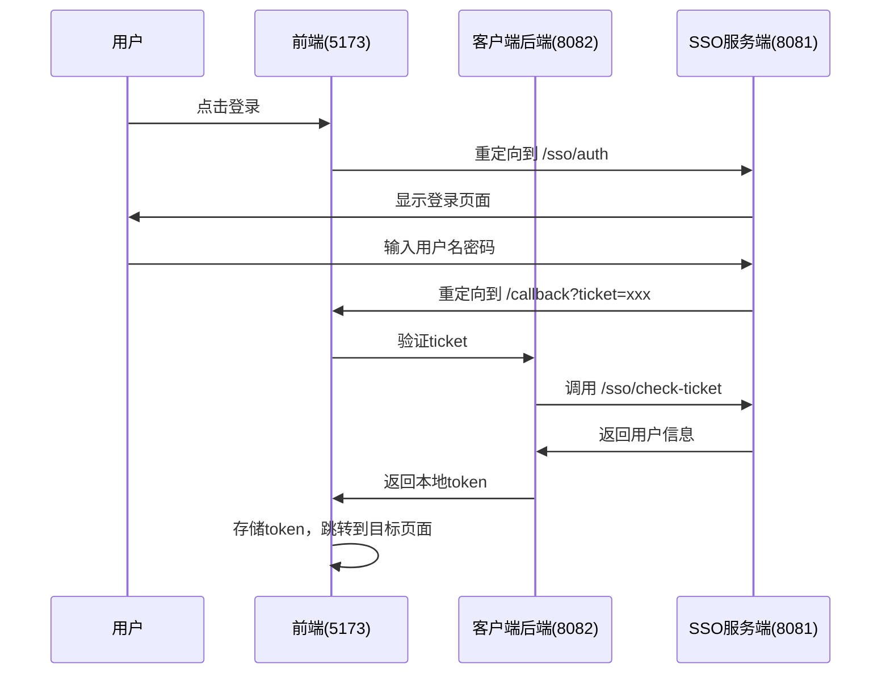

# SSO 连接问题诊断指南

## 🚨 问题描述

在 `localhost:3000` 点击登录后跳转到 `localhost:8081` 显示：
```json
{
  "code": 401,
  "message": "未提供token",
  "timestamp": 1755620278973,
  "success": false
}
```

## 🔍 问题分析

### 根本原因
1. **端口配置不一致**：前端配置混乱，同时存在3000和5173端口
2. **SSO登录路径错误**：前端跳转到 `/login` 而不是 `/sso/auth`
3. **Token传递机制不匹配**：前端和后端的token处理方式不一致

### 具体问题

#### 1. 端口配置问题
- **Vite配置**：`port: 3000` 但README说是 `5173`
- **SSO配置**：CLIENT_URL 设置为 `localhost:3000`
- **实际运行**：可能在不同端口运行

#### 2. SSO流程不匹配
- **前端期望**：`/login` 接口
- **Sa-Token实际**：`/sso/auth` 接口
- **回调处理**：前端期望token参数，但Sa-Token使用ticket机制

#### 3. Token传递问题
- **前端**：期望在URL中接收token参数
- **Sa-Token**：使用ticket验证机制
- **客户端后端**：需要验证ticket并生成本地token

## ✅ 解决方案

### 1. 修正配置文件

已修正以下文件：
- `sso-client-frontend/vite.config.js` - 端口改为5173
- `sso-client-frontend/src/stores/auth.js` - 登录路径改为 `/sso/auth`
- `sso-client-frontend/src/config/sso.js` - CLIENT_URL改为5173端口

### 2. 正确的SSO流程



### 3. 测试步骤

1. **启动服务**
   ```bash
   # 启动SSO服务端 (8081)
   cd sso-server
   mvn spring-boot:run

   # 启动客户端后端 (8082)
   cd sso-client-backend
   mvn spring-boot:run

   # 启动客户端前端 (5173)
   cd sso-client-frontend
   npm run dev
   ```

2. **访问测试页面**
   ```
   http://localhost:5173/sso-test
   ```

3. **测试流程**
   - 点击"测试SSO登录"
   - 在SSO页面输入用户名密码
   - 观察回调处理过程

### 4. 调试检查点

#### 前端检查
- [ ] 浏览器控制台是否有错误
- [ ] 网络请求是否正确代理到8082
- [ ] Token是否正确存储到Cookie

#### 后端检查
- [ ] 客户端后端是否正常启动在8082
- [ ] SSO服务端是否正常启动在8081
- [ ] 数据库连接是否正常

#### SSO服务端检查
- [ ] `/sso/auth` 接口是否可访问
- [ ] 登录页面是否正常显示
- [ ] 用户认证是否成功

## 🛠️ 常见问题解决

### 问题1：CORS跨域错误
**解决方案**：检查Sa-Token配置中的CORS设置
```yaml
sa-token:
  cors:
    is-open: true
    allow-origin: "*"
```

### 问题2：代理不生效
**解决方案**：重启前端开发服务器
```bash
npm run dev
```

### 问题3：Token验证失败
**解决方案**：检查token传递方式
- 前端：使用 `satoken` header
- 后端：验证header中的token

### 问题4：数据库连接失败
**解决方案**：检查数据库配置和服务状态
```bash
mysql -u root -p -e "SHOW DATABASES;"
```

## 📝 验证清单

- [ ] 前端运行在 http://localhost:5173
- [ ] 客户端后端运行在 http://localhost:8082
- [ ] SSO服务端运行在 http://localhost:8081
- [ ] 点击登录跳转到 `/sso/auth`
- [ ] 登录成功后回调到 `/callback`
- [ ] Token正确存储和传递
- [ ] 用户信息正确获取

## 🔗 相关文档

- [Sa-Token SSO文档](https://sa-token.cc/doc.html#/sso/sso-type1)
- [Vue Router文档](https://router.vuejs.org/)
- [Axios配置文档](https://axios-http.com/docs/config_defaults)
